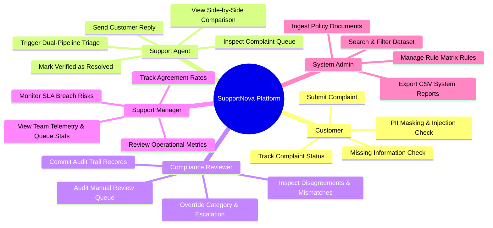
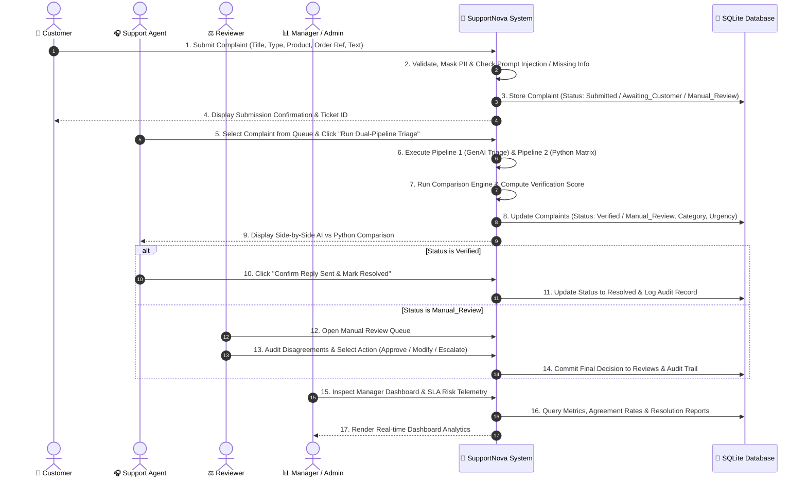
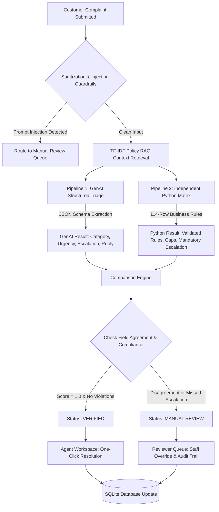

# SupportNova - User Flow & System Architecture Diagrams

This document illustrates the role-based user workflows, capabilities, and dual-pipeline execution architecture for **SupportNova**.

---

## 👥 1. Role-Based User Responsibilities & Capabilities

---

## 🔄 2. End-to-End User Flow (Sequence Diagram)

---

## 🛡️ 3. Dual-Pipeline Triage & Verification Architecture

